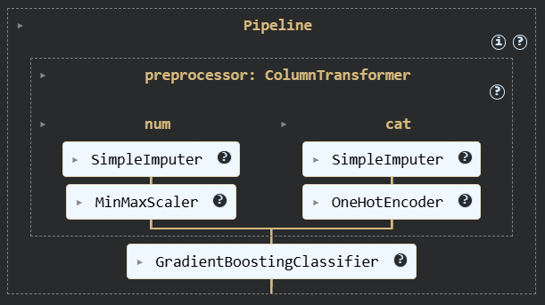
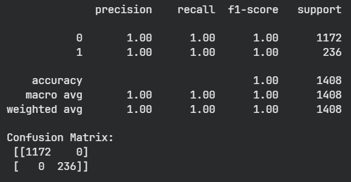
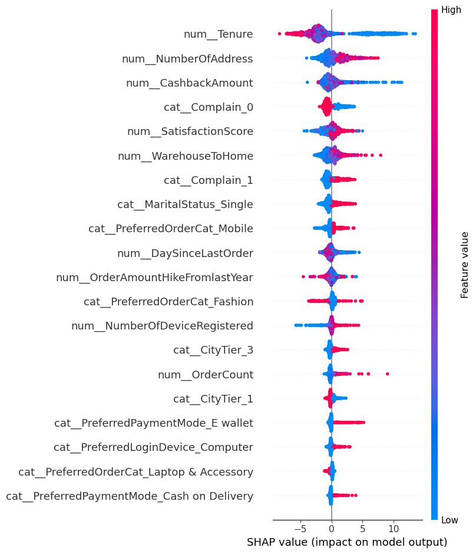

# Customer Churn Prediction - Case Study

This case study explores customer churn prediction using Gradient Boosting and interprets the model using SHAP.

### Objective
---
Predict which customers are more likely to churn and understand the reason behind each prediction using explainable AI. 

### Contents
---
- `assets/` : Directory with images for the README file.
- `data/` : Includes input dataset, as well as its cleaned version, along with reproducible train and test split.
- `models/` : Directory with fitted models, preprocessor and pipelines.
- `notebooks/` : Directory with .ipynb files. Includes:
    - `1-data_exploration.ipynb` : Data loading, cleaning, and EDA
    - `2-modeling.ipynb` : Pipeline definition, model selection, hyperparameter optimization
    - `3-explainability.ipynb` : Model interpretation with SHAP, strategy proposal
- `20250625-assignment.pdf` : PDF file containing the specifics of the assignment
- `Churn_Presentation` : A presentation of the project, both in .pptx and .pdf format.
- `README.md` : Project summary
- `requirements.txt` : Dependencies

### Methodology
---
- Model : Gradient Boosting Classifier & Random Forest Classifier

- Data : Customer behavior and account data
- Steps : 
    
    1. Data cleaning and explorative analysis
    2. Feature engineering
    3. Model training, evaluation, comparison and hyperparameter tuning
    4. Explainability with SHAP

### Classification Report
---

### Explainability with SHAP
---
SHAP values were used to interpret:

- Global patterns (which features matter most overall)

- Local decisions (why a specific customer is predicted to churn)

Summary plot:

### Insights and Strategy Proposal
---
Top features:

- Tenure
- Number of Address
- Cashback Amount
- Complain
- Satisfaction Score

Some strategies to adopt:

- For low tenure customers: Onboarding campaign and loyalty programs. 

- For high number of address customers: Likely movers, make offers around home utilities or free delivery service

- Low cashback: high churn. High cashback: no contribution.
    
    Consider dropping cashback strategy altogether.

- For complaining customers: Write personalized emails to increase empathy, accountability and propose offers or compensation.

- Satisfaction score is weird. Low satisfaction is linked with low churn rate. This pattern may reflect survey timing, data gaps, or deeper interactions among features.

### Conclusion
---
Gradient Boosting provided strong predictive performance, and SHAP added transparency, making the model more trustworthy and actionable for real-world applications.
